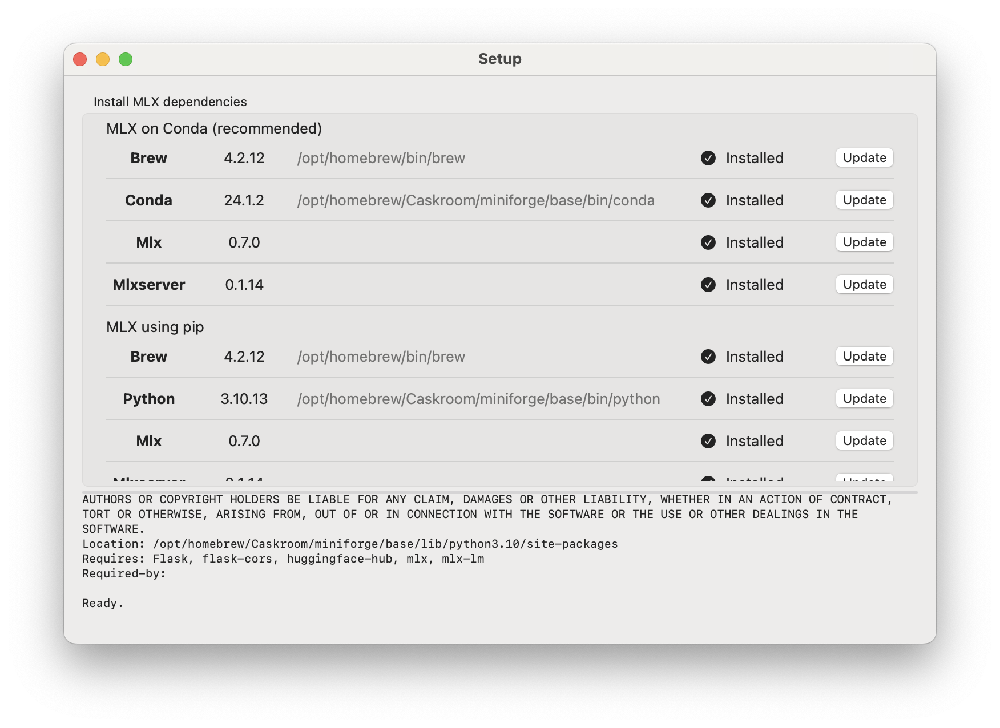

# Pico MLX Server

Pico MLX Server is the easiest way to get started with Apple's [MLX AI framework](https://github.com/ml-explore/mlx)

Pico MLX Server provides a GUI for [MLX Server](https://github.com/mustafaaljadery/mlxserver). MLX server provides an API for local MLX models conform the [OpenAI API](https://platform.openai.com/docs/api-reference/completions/create). This allows you to use most existing OpenAI chat clients with Pico MLX Server.


## Highlights

- Start and stop servers quickly via menu bar extra
- Download MLX models from the [MLX community on HuggingFace](https://huggingface.co/mlx-community)
- Install and setup Python environment, MLX, and MLX Server from within Pico MLX Server.
- Run multiple servers on different ports
- View logs of the servers in separte windows
- Custom link to open your favorite chat client (defaults to [Pico AI Assistant](https://apps.apple.com/us/app/pico-ai-copilot/id1668205047))

### Supported MLX models

See [MLX Community on HuggingFace](https://huggingface.co/mlx-community)

## Getting Started

### Install

To set up Pico MLX Server, open the app and 
- Install and set up Python, pip, [MLX](https://github.com/ml-explore/mlx) and [MLX Server](https://github.com/mustafaaljadery/mlxserver) and optionally Conda manually
- Use Pico MLX Server's automated Setup (`MLX -> Setup...`)
- Pico MLX Server uses [Conda](https://docs.conda.io/en/latest/) by default to create a virtual environment for the servers called pico. This (hopefully) will avoid any Python version issues. Conda can be disabled in `Settings`



### Create a New Server


- Select `MLX -> Servers -> New Server...`
- Press `Create` to create the default server `mlx-community/Nous-Hermes-2-Mistral-7B-DPO-4bit-MLX` on port `8080`
- To use a different model, click on the `v` button or type in a model manually from the [MLX Community](https://huggingface.co/mlx-community) on HuggingFace (make sure to use the `mlx-community/` prefix)
- Press the `View Logs` buttons to open a window with the server's real-time logs


### Use Pico MLX Server with an AI client

- Point any OpenAI API compatible AI assistant to `http://127.0.0.1:8080` (or any other port you used in Pico MLX Server). (Instructions for Pico AI Assistant coming soon)
- Curl:

  ```
  curl -X GET 'http://127.0.0.1:8080/generate?prompt=write%20me%20a%20poem%20about%the%20ocean&stream=true'
  ```

### API Endpoints

- Pico MLX Server uses OpenAI's `POST /v1/completions` API. See for more information https://platform.openai.com/docs/api-reference/completions/create.

## Known Issues

- Pico MLX Server doesn't detect if a port is already in use (use `lsof -i:8080` in the terminal to find the PID of the running server)
- There is a SwiftUI issue in `New Server` window and the `Servers` menu where the state of servers isn't updated

## Roadmap

- Switch from Python to [MLX Swift](https://github.com/ml-explore/mlx-swift)
- Swift-based HTTP server

## Related projects

- [MLX](https://github.com/ml-explore/mlx)
- [MLX Swift](https://github.com/ml-explore/mlx-swift)
- [MLX Server](https://github.com/mustafaaljadery/mlxserver)
- [MLX Community](https://huggingface.co/mlx-community)

Pico MLX Server is part of a bundle of open source Swift tools for AI engineers.
Looking for a server-side Swift OpenAI proxy to protect your OpenAI keys? Check out [Swift OpenAI Proxy](https://github.com/ronaldmannak/SwiftOpenAIProxy).

## Authors and Acknowledgements

Pico MLX Server, [Swift OpenAI Proxy](https://github.com/ronaldmannak/SwiftOpenAIProxy), and [Pico AI Assistant](https://apps.apple.com/us/app/pico-ai-copilot/id1668205047) were created by [Ronald Mannak](https://twitter.com/ronaldmannak) with help from [Ray Fernando](https://twitter.com/rayfernando1337/)

MLX Server was created by [Mustafa Aljadery](https://www.maxaljadery.com/) & [Siddharth Sharma](https://stanford.edu/~sidshr/)

Code used from [MLX Swift Chat](https://github.com/PreternaturalAI/mlx-swift-chat) and [Swift Chat](https://github.com/huggingface/swift-chat)

